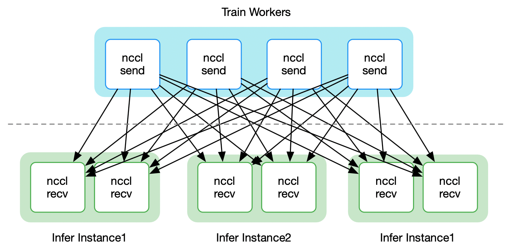
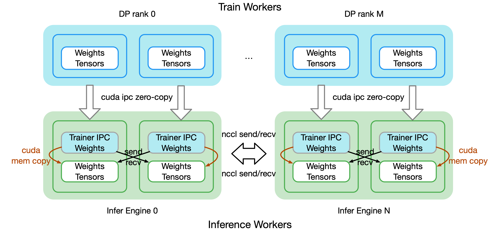

**Awex** is a high-performance RL training-inference **weight synchronization** framework,
designed to enable **second-level parameter updates** from training to inference in RL workflows.
It minimizes iteration latency, ensuring rollout phases consistently use the latest model.

## Architecture

The Awex weight exchange framework consists primarily of three components:

- **WeightWriter**: Runs within each training process, responsible for metadata collection and reporting of weight shards for the current training process, weight convert, resharding transfer plan construction, weight transmission, and other functions;
- **WeightReader**: Runs on the control process of each inference instance, which starts a WorkerWeightsReader on each GPU managed by the inference instance, corresponding to the WeightWriter of the training process. Responsible for metadata collection and reporting of weight shards for each inference process, weight convert, resharding transfer plan construction, weight reception, and other functions;
- **MetaServer**: Job-level global server for service discovery and weight metadata exchange between training and inference engines, as well as event notification functions in co-located scenarios;

   

The core functional modules of weight exchange consist mainly of 5 parts:

- **Unified training-inference weight convert**: Responsible for converting weights from training and inference engines with **different parallelism strategies and tensor layouts** into a **unified format** for subsequent weight metadata calculation and weight transmission;
- **Global weight metadata calculation and exchange**: After converting training and inference weights into a unified format, collects all weight shard metadata from each worker and reports to Meta Server for subsequent weight transmission plan construction;
- **P2P weight transmission execution plan**: Training and inference engines obtain global weight shard metadata from all workers, then separately construct peer-to-peer deterministic transfer plan for sending and receiving;
- **NCCL weight transmission**: Uses NCCL's send/recv API for peer-to-peer weight transmission based on the constructed transmission plan;
- **RDMA weight transmission**: Uses NUMA affinity and RDMA communication for globally load-balanced transfer plan for weight updates;

**NCCL Separate Mode**:

   

**NCCL Colocate Mode**:

   

**RDMA Mode**

Coming soon
